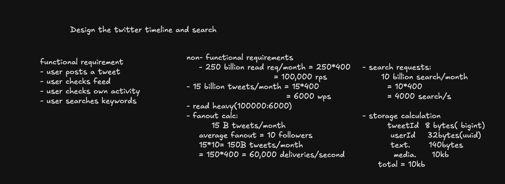
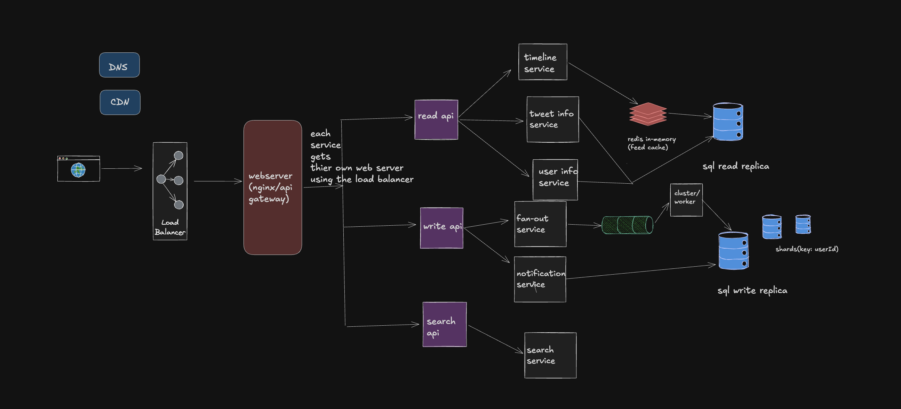

# Twitter Timeline & Search — System Design

A high-level architecture for Twitter's core features: posting tweets, browsing feeds, and searching by keyword. The design handles massive read-heavy traffic with a fan-out delivery model and sharded SQL storage.

---

## Requirements

### Functional Requirements

- User posts a tweet
- User checks their feed (timeline)
- User checks their own activity
- User searches by keyword

### Non-Functional Requirements

| Metric | Calculation | Result |
|---|---|---|
| Read throughput | 250B reads/month ÷ 2.5M seconds | **100,000 RPS** |
| Write throughput | 15B tweets/month ÷ 2.5M seconds | **6,000 WPS** |
| Read/Write ratio | 100,000 : 6,000 | **~17:1 (read-heavy)** |
| Search throughput | 10B searches/month ÷ 2.5M seconds | **4,000 search/s** |
| Fan-out deliveries | 15B tweets × avg 10 followers × 400 servers | **60,000 deliveries/s** |

### Storage Per Tweet

| Field | Size |
|---|---|
| `tweetId` | 8 bytes (bigint) |
| `userId` | 32 bytes (UUID) |
| `text` | 140 bytes |
| `media` | ~10 KB |
| **Total** | **~10 KB** |

---

## System Design

### Architecture Overview

Traffic flows through a **DNS + CDN** layer into a **Load Balancer**, which routes requests to an **Nginx/API Gateway (web server)**. From there, requests fan out to three API surfaces:

#### Read API
Handles feed and profile reads. Connects to:
- **Timeline Service** — assembles a user's home feed
- **Tweet Info Service** — fetches tweet metadata
- **User Info Service** — fetches user profile data

Reads are served from a **Redis in-memory cache (feed cache)** backed by a **SQL Read Replica** for cache misses.

#### Write API
Handles new tweet submissions. Connects to:
- **Fan-out Service** — pushes new tweets to followers' cached timelines via a message queue (cluster/worker)
- **Notification Service** — triggers push/email notifications

Writes land on a **SQL Write Replica** sharded by `userId`.

#### Search API
Routes keyword queries to a dedicated **Search Service**, decoupled from the main read/write path.

---

## Key Design Decisions

**Fan-out on Write** — When a tweet is posted, it is pre-delivered to each follower's cached timeline. This makes reads extremely fast (just a cache lookup) at the cost of write amplification (~60,000 deliveries/s).

**Redis Feed Cache** — The in-memory cache holds pre-assembled timelines so the Read API can respond without touching the database for the common case.

**SQL Sharding by `userId`** — Write replicas are horizontally sharded using `userId` as the shard key, distributing write load evenly across nodes.

**Service Isolation** — Each service (timeline, tweet info, user info, fan-out, notification, search) gets its own web server behind the load balancer, allowing independent scaling and deployment.

**Read Replicas** — A dedicated SQL read replica serves all read queries, keeping the write primary free for ingestion.

---

## Component Summary

| Component | Role |
|---|---|
| DNS | Domain resolution |
| CDN | Static asset caching |
| Load Balancer | Traffic distribution |
| Web Server (Nginx/API Gateway) | Routing & auth |
| Read API | Feed, tweet, user reads |
| Write API | Tweet ingestion |
| Search API | Keyword search |
| Timeline Service | Feed assembly |
| Fan-out Service | Deliver tweets to follower caches |
| Notification Service | Push/email alerts |
| Search Service | Full-text search |
| Redis (feed cache) | In-memory pre-built timelines |
| SQL Read Replica | Read-optimised query serving |
| SQL Write Replica (sharded) | Durable tweet storage |
