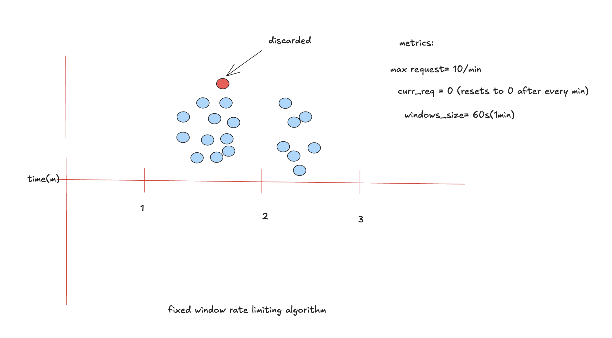

# Fixed Window Rate Limiting Algorithm

## Overview
The **Fixed Window Algorithm** divides time into fixed intervals (windows). Each window allows up to a maximum number of requests. When a new window starts, the request counter resets to zero.

---

## Architecture Diagram

```text
                 Incoming Request
                        |
                        v
                +----------------+
                | Acquire Lock 🔒 |
                +----------------+
                        |
                        v
        +-------------------------------+
        | Has current window expired?   |
        +-------------------------------+
             | Yes                 | No
             v                     |
 Reset counter = 0                 |
 lastChanged = now                 |
             \_____________________/
                        |
                        v
          +---------------------------+
          | requests < maxRequests ? |
          +---------------------------+
              | Yes              | No
              v                  v
      requests += 1          Reject Request
      Accept Request
```

---

## Python Implementation

```python
import time
import threading

class FixedwindowAlgo:
    def __init__(self , windowSize: int, maxRequest: int):
        self.maxRequests= maxRequest
        self.windowSize = windowSize
        self.requests = 0
        self.lock= threading.Lock()
        self.lastChanged= time.time()

    def allowRequest(self) -> bool:
        with self.lock:
            now= time.time()
            if now - self.lastChanged >= self.windowSize:
                self.requests=0
                self.lastChanged=now

            if self.requests < self.maxRequests:
                self.requests+=1
                return True
            else:
                return False

    def totalRequests(self) -> int:
        with self.lock:
            return self.requests

fixedWindow = FixedwindowAlgo(10, 10)
for i in range(20):
    if fixedWindow.allowRequest():
        print(f"Request {i+1} accepted , total requests: {fixedWindow.totalRequests()}")
    else:
        print(f"request {i+1} disallowed")
    time.sleep(0.8)
```

## Thread Safety

This implementation is **thread-safe** because:

- A `threading.Lock()` protects shared state.
- `allowRequest()` wraps the entire check-update sequence inside `with self.lock`.
- `totalRequests()` also acquires the same lock before reading the counter.
- This prevents race conditions where multiple threads could simultaneously accept requests beyond the configured limit.

Without the lock:
- Two threads could both observe `requests < maxRequests`.
- Both increment the counter.
- More than the allowed number of requests could be accepted.

---

## Complexity

| Operation | Time | Space |
|-----------|------|-------|
| Allow Request | O(1) | O(1) |
| Total Requests | O(1) | O(1) |

---

## Advantages

- Very simple implementation
- Constant memory usage
- Fast (O(1))
- Easy to understand

## Disadvantages

- Suffers from the **boundary problem**. Clients can send many requests at the end of one window and again immediately at the start of the next window, causing a burst.

## System Design Diagram



---

## References

- https://www.geeksforgeeks.org/system-design/rate-limiting-algorithms-system-design/
- https://mjmichael.medium.com/fixed-window-algorithm-a-dive-with-python-and-golang-implementations-bf662cabcca1
