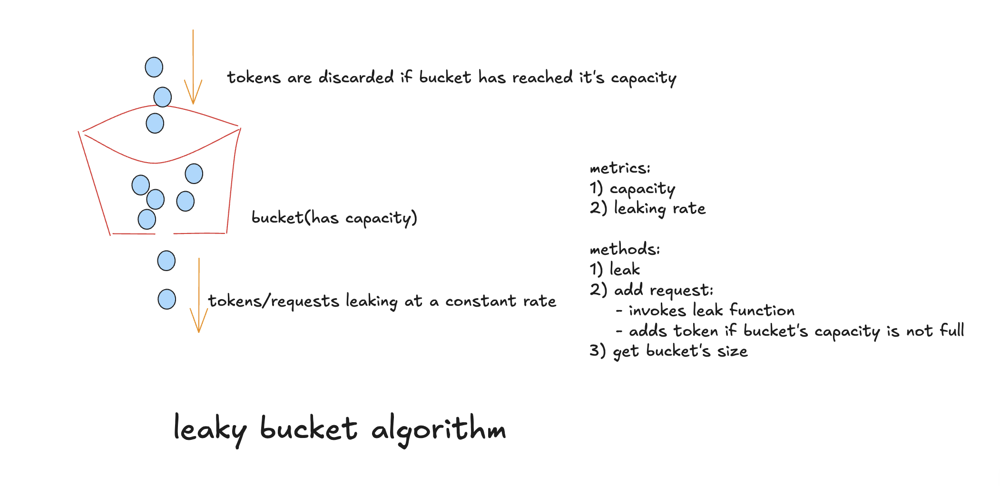

# Leaky Bucket Algorithm (Rate Limiting)

## Overview
The **Leaky Bucket Algorithm** limits request rates by placing incoming requests into a bucket (queue) that leaks at a constant rate. This produces a smooth, predictable output rate and prevents sudden traffic spikes from overwhelming a system.

## How It Works
- The bucket has a fixed capacity.
- New requests are added to the bucket if space is available.
- Requests "leak" from the bucket at a constant rate.
- If the bucket is full, new requests are rejected.

## Key Parameters
- **Capacity** – Maximum number of requests the bucket can hold.
- **Leak Rate** – Number of requests processed (removed) per second.
- **Bucket Size** – Current number of requests in the bucket.

## Example
Capacity = 20, Leak Rate = 2 requests/sec

- Initially: bucket = 0
- 20 requests arrive quickly → all accepted.
- Bucket becomes full.
- Any additional request is rejected until enough requests have leaked out.

---

# Thread Safety

## What is Thread Safety?

A program is **thread-safe** when multiple threads can access or modify shared data simultaneously **without causing inconsistent or corrupted results**.

In this implementation, the shared resources are:

- `bucketSize`
- `lastLeak`

If multiple threads call `addRequest()` at the same time, both could read the same bucket size before either updates it.

### Without Locks (Race Condition)

Suppose:

- Capacity = 20
- Current bucket size = 19

Two threads execute simultaneously:

Thread A:
1. Reads bucket size = 19
2. Checks `19 < 20` → True

Thread B:
1. Reads bucket size = 19
2. Checks `19 < 20` → True

Both increment the bucket.

Final bucket size = **21**, exceeding the configured capacity.

This is called a **race condition**.

---

## How Thread Safety is Achieved

The implementation uses Python's `threading.Lock`.

```python
self.lock = threading.Lock()
```

Whenever the bucket is modified or read, the lock is acquired:

```python
with self.lock:
    self.leak()

    if self.bucketSize < self.capacity:
        self.bucketSize += 1
        return True
```

Only **one thread** can execute this block at a time.

Other threads must wait until the lock is released.

This guarantees:

- No race conditions
- Bucket size never exceeds capacity
- Consistent updates to `lastLeak`
- Correct request acceptance/rejection decisions

## Why `getBucketSize()` Also Uses the Lock

```python
with self.lock:
    self.leak()
    return self.bucketSize
```

Although this method only returns the bucket size, it still calls `leak()`.

`leak()` updates:

- `bucketSize`
- `lastLeak`

Without locking, another thread could modify these values simultaneously, causing inconsistent results.

Calling `leak()` before returning the size also ensures the value reflects the elapsed time since the previous operation.

---

# Pros

- Handles traffic smoothly
- Prevents sudden spikes
- Simple implementation
- Good for networking and traffic shaping

# Cons

- Doesn't allow burst traffic like Token Bucket
- Legitimate requests may be rejected when full
- Adds latency because requests wait in the queue
- Requires synchronization in multithreaded systems

# Comparison

| Algorithm | Burst Support | Output Rate | Best Use |
|---|---|---|---|
| Leaky Bucket | ❌ | Constant | Traffic shaping |
| Token Bucket | ✅ | Variable | APIs |
| Fixed Window | Limited | Window based | Simple limiters |
| Sliding Window Counter | Good | Smooth | Modern APIs |
| Sliding Window Log | Excellent | Smooth | High accuracy |

# Use Cases

- Network routers
- API gateways
- Reverse proxies
- Telecom systems
- Load balancers

# Diagram




# Resources

- https://www.geeksforgeeks.org/system-design/rate-limiting-algorithms-system-design/
- https://mjmichael.medium.com/leaky-bucket-algorithm-with-implementations-in-python-and-golang-ae963b477c43
