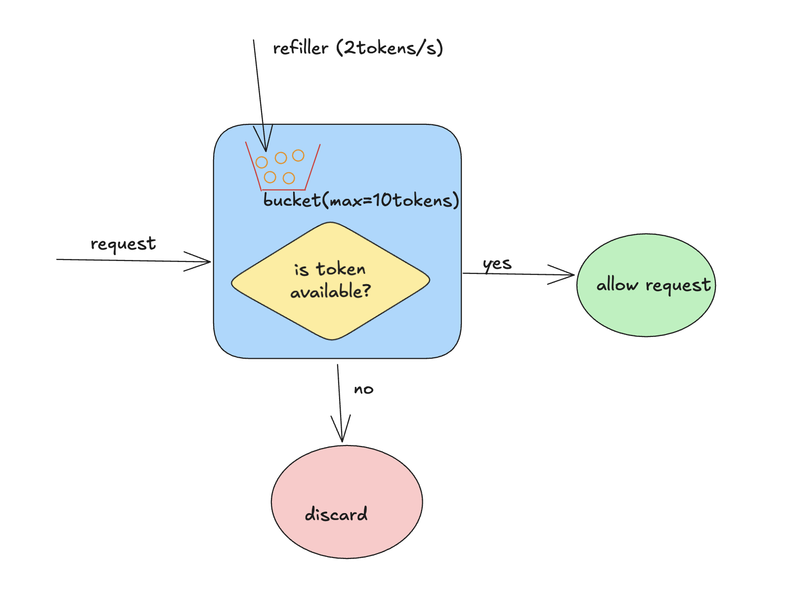

# Token Bucket Algorithm (Rate Limiting)

## Overview
The **Token Bucket Algorithm** is a widely used rate-limiting technique in system design. It controls how many requests a user or system can make in a given time while allowing short bursts of traffic.

This algorithm is commonly used in APIs, network traffic shaping, and distributed systems.

---

## How It Works

Imagine a bucket filled with tokens:

- The bucket has a **fixed capacity**.
- Tokens are added at a constant **refill rate** (e.g., 1 token per second).
- Each incoming request **consumes one token**.
- If the bucket has tokens → request is allowed.
- If the bucket is empty → request is rejected or delayed.

---

## Key Parameters

- **Capacity (C)**: Maximum number of tokens the bucket can hold.
- **Refill Rate (R)**: Number of tokens added per second.
- **Current Tokens (T)**: Current available tokens.

---

## Algorithm Steps

1. Initialize bucket with full capacity.
2. Continuously add tokens at a fixed refill rate.
3. On each request:
   - If tokens > 0 → consume 1 token → allow request
   - Else → reject or throttle request

---

## Simple Example

- Capacity = 10 tokens
- Refill rate = 1 token/sec

At time 0:
- Bucket = 10 tokens

If 10 requests arrive instantly:
- All 10 are allowed and bucket becomes 0

Next request:
- Blocked until new tokens are added

After 5 seconds:
- Bucket refills to 5 tokens → 5 requests allowed again

---

## Advantages (Pros)

- Allows **bursty traffic handling**
- Simple to implement
- Efficient for distributed systems
- Smooth rate limiting over time
- Flexible control over traffic spikes

---

## Disadvantages (Cons)

- Can allow sudden bursts (not strictly smooth)
- Requires careful tuning of refill rate and capacity
- Slight complexity in distributed systems synchronization
- May not be ideal for strict per-second limits

---

## Real-World Usage

The Token Bucket algorithm is widely used in:

- **API Gateways** (e.g., AWS API Gateway)
- **Cloud services** (rate limiting user requests)
- **CDNs** like Cloudflare (traffic shaping)
- **Web servers** like Nginx
- **Google APIs** (request throttling mechanisms)

It is especially useful where **burst traffic is acceptable but controlled over time**.

---

## System Design Diagram

*(Place your diagram image in the same directory as this markdown file)*

---

## Resources

- https://www.geeksforgeeks.org/system-design/rate-limiting-algorithms-system-design/
- https://mjmichael.medium.com/token-bucket-algorithm-rate-limiting-explained-with-python-go-73a9f192fda3

