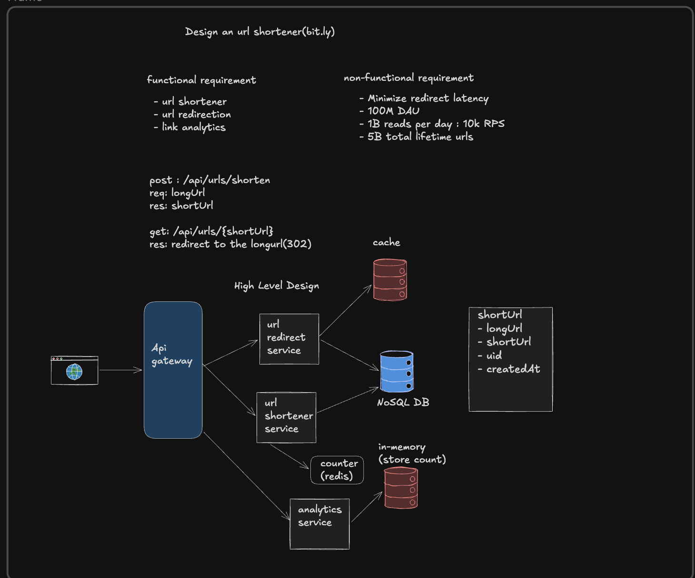

# URL Shortener System Design



## Overview
This document describes a scalable URL shortening service similar to Bit.ly.

## Functional Requirements
- Shorten long URLs
- Redirect short URLs to original URLs
- Link analytics

## Non-functional Requirements
- Low redirect latency
- 100M Daily Active Users
- ~1B reads/day (~10K RPS average)
- 5B lifetime URLs

## APIs

### Create Short URL
```http
POST /api/urls/shorten
```
Request:
```json
{"longUrl":"https://example.com"}
```
Response:
```json
{"shortUrl":"https://sho.rt/abc123"}
```

### Redirect
```http
GET /api/urls/{shortUrl}
```
Returns **HTTP 302 Redirect** to the original URL.

## High-Level Components

### API Gateway
- Authentication
- Rate limiting
- Routing
- Load balancing

### URL Shortener Service
- Generates unique short IDs
- Stores URL mappings
- Updates analytics counters

### URL Redirect Service
- Looks up short URL
- Checks cache first
- Falls back to NoSQL database
- Returns HTTP 302 redirect

### Cache (Redis)
Stores hot URL mappings to reduce latency and database load.

### NoSQL Database
Stores URL mappings.

Example schema:

| Field | Description |
|------|-------------|
| shortUrl | Short code |
| longUrl | Original URL |
| uid | Owner |
| createdAt | Creation timestamp |

### Analytics Service
Tracks clicks, stores counters in memory, periodically flushes to persistent storage.

## Request Flow

### URL Creation
1. Client → API Gateway
2. Gateway → URL Shortener Service
3. Generate short code
4. Save mapping in NoSQL
5. Return short URL

### URL Redirection
1. Client requests short URL
2. API Gateway forwards request
3. Redirect service checks Redis
4. Cache hit → Redirect
5. Cache miss → Read from NoSQL, update cache, redirect

### Analytics
Each redirect increments an in-memory counter. Counters are periodically persisted asynchronously.

## Scaling
- Stateless services
- Horizontal scaling
- Redis caching
- NoSQL partitioning/sharding
- Load balancer
- Asynchronous analytics

## Bottlenecks
- Cache misses
- Hot URLs
- Database hotspots
- Counter synchronization

## Improvements
- CDN for redirects
- Bloom filter
- Multi-region deployment
- Read replicas
- Distributed ID generation (Snowflake)

